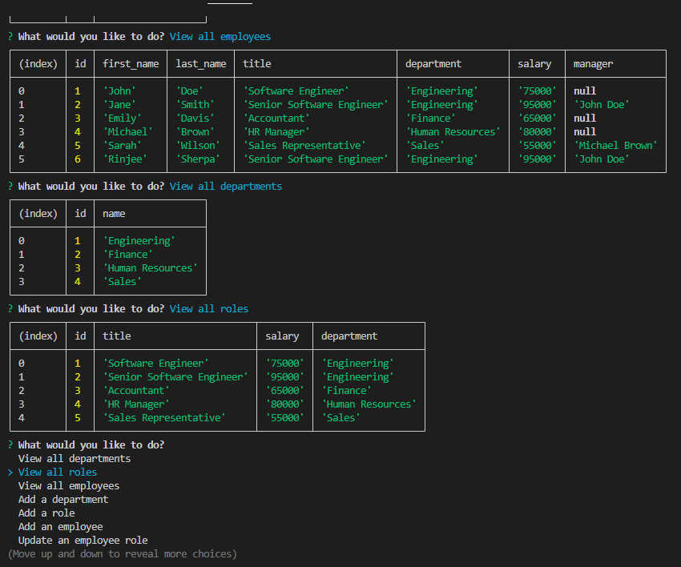

# Employee Tracker

## Description

Employee Tracker is a command-line application for business owners to manage company departments, roles, and employees efficiently.

## User Story

As a business owner, I want to view and manage the departments, roles, and employees in my company to organize and plan my business.

## Features

- View all departments
- View all roles
- View all employees
- Add a department
- Add a role
- Add an employee
- Update an employee role

## Usage

Start the application:
```sh
node index.js
```

## Technologies Used

- Node.js
- Inquirer.js
- MySQL
- Console.table

## Contributing

Contributions are welcome! Please fork the repository and create a pull request.

## License

This project is licensed under the MIT License. See the [LICENSE](LICENSE) file for details.

## Screenshots



## Screen recording

https://drive.google.com/file/d/1yMhksYFMHjthtAnMtob-dvY-ohbXVkVl/view